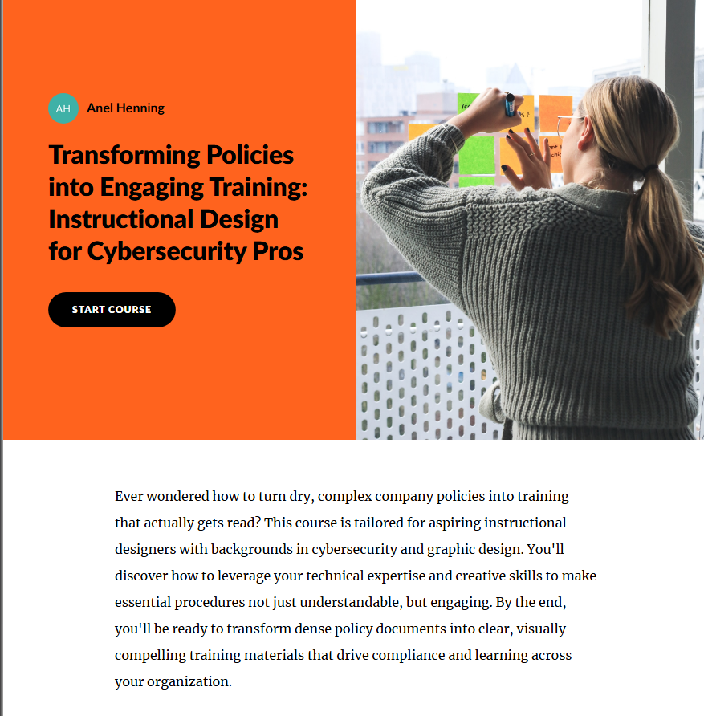
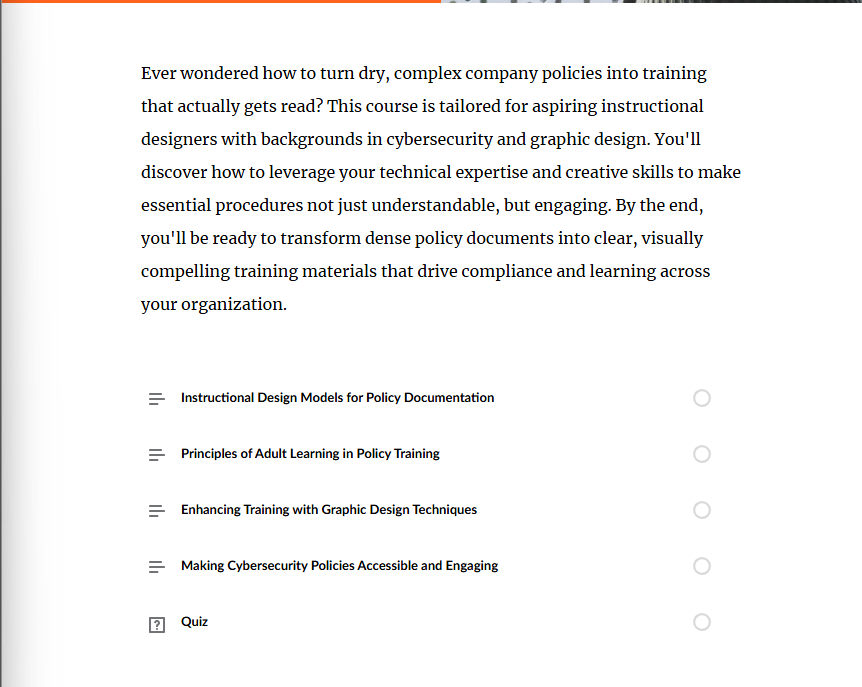
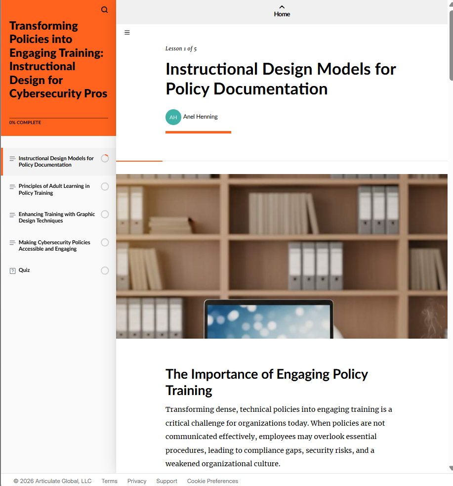
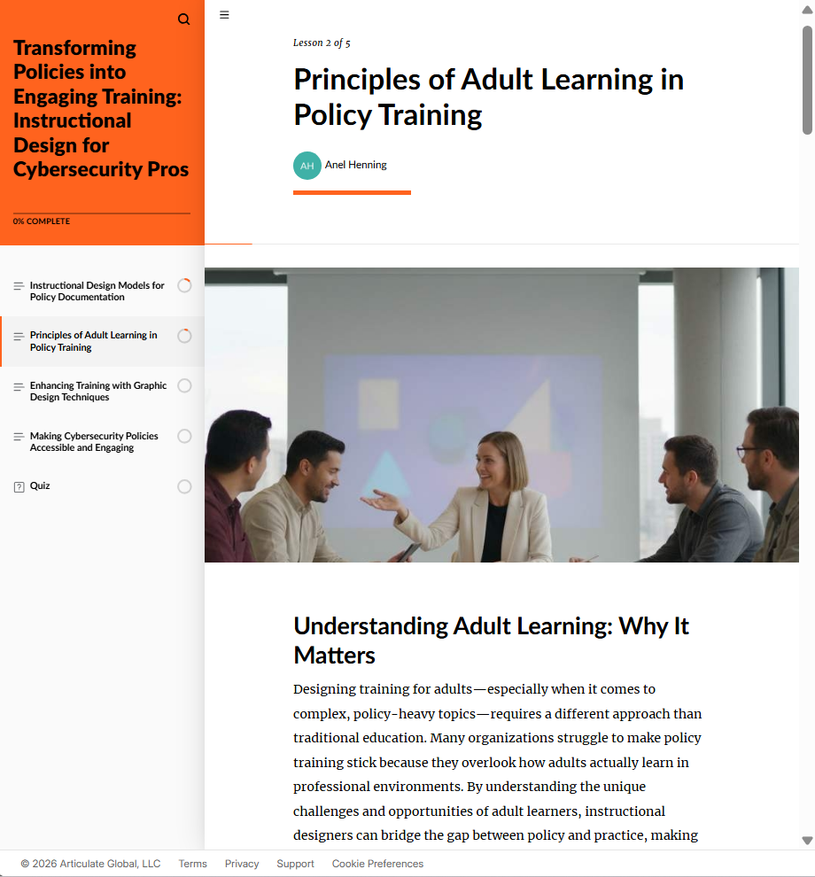
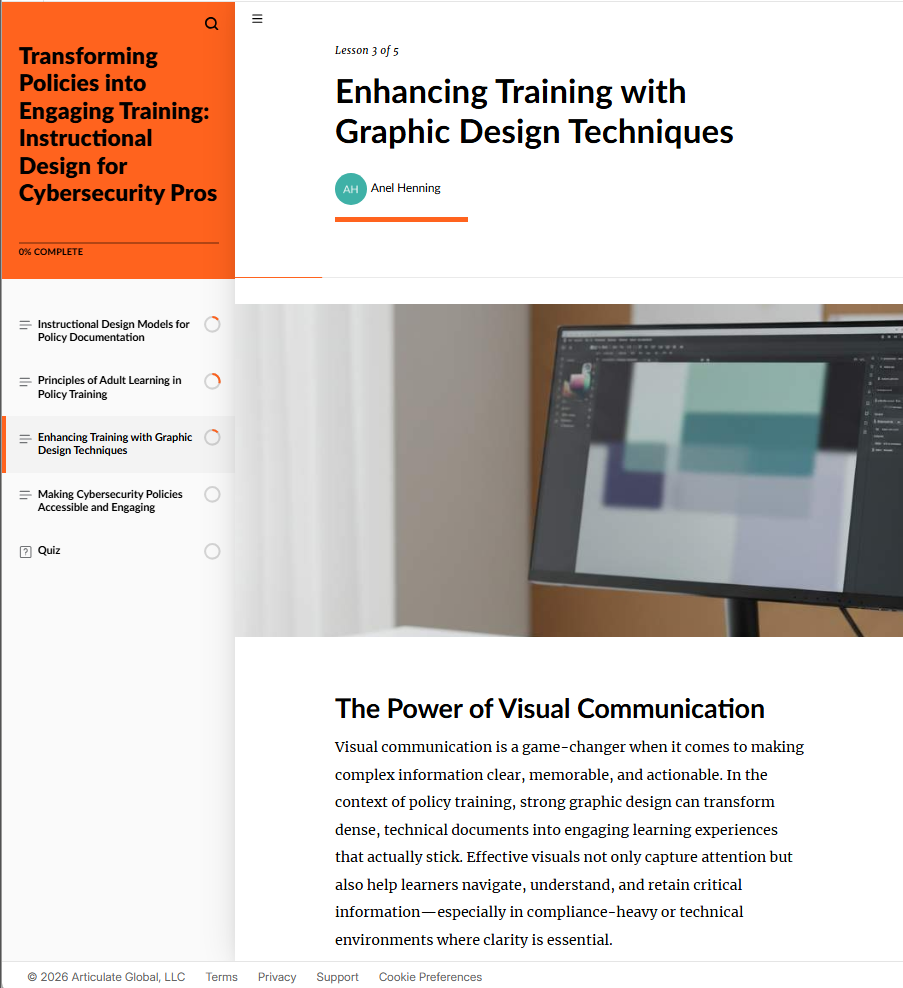
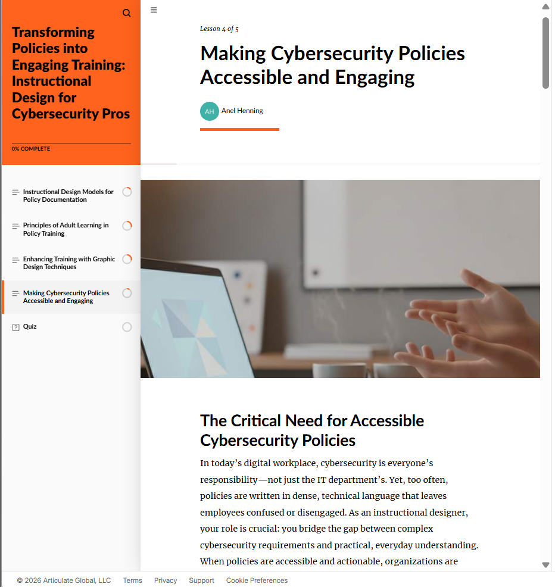
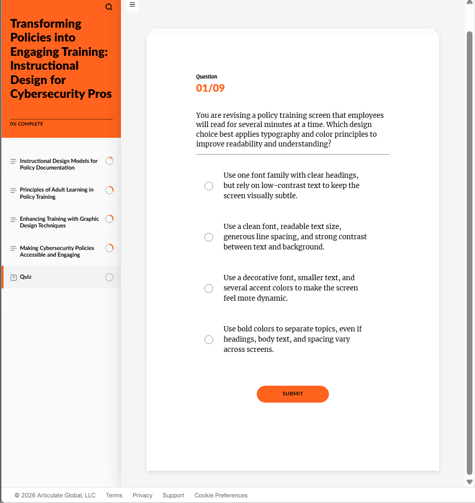

# Transforming Policies into Engaging Training: Instructional Design for Cybersecurity Pros — Case Study

**Format:** Self-paced Articulate Rise 360 course — 4 lessons + a scored quiz
**Audience:** Aspiring instructional designers with a cybersecurity or graphic design background who need to turn dense company policy into training people actually read
**Tool:** Built in Articulate Rise 360 — an industry-standard authoring tool, not a custom-coded module like the other pieces in this portfolio
**Role:** Instructional Designer (needs assessment through build)

## 1. Needs Assessment

**The gap:** Organizations often have well-written security and compliance policies that employees never actually read, because the material is delivered as dense documents rather than structured learning. People with strong technical or design backgrounds moving into instructional design need a bridge between "I know the subject matter" and "I know how to teach it."

**Why this matters:** Policy that isn't understood isn't followed — a training format problem, not a content problem. Someone who can combine subject-matter depth (cybersecurity) with design sense (graphic design) and instructional structure (ADDIE-style models, adult learning theory) is positioned to fix that gap directly.

## 2. Learning Objectives

By the end of this course, learners will be able to:
1. Identify instructional design models relevant to turning policy documentation into training
2. Apply adult learning principles specifically to policy-heavy training content
3. Use graphic design techniques (typography, color, contrast) to improve training readability
4. Evaluate design choices for accessibility and engagement in cybersecurity policy training
5. Apply all of the above via a scored quiz with applied, scenario-based questions

## 3. Design Decisions

- **Built in an industry-standard tool, not custom code.** Every other module in this portfolio was hand-built in HTML/CSS/JS to control every design decision directly. This one is deliberately built in Articulate Rise 360 instead, to demonstrate real fluency with the authoring tool most instructional design job postings name specifically.
- **Applied, not recall-based, quiz questions.** The quiz doesn't ask learners to define a term — it presents a design scenario ("you're revising a policy training screen employees will read for several minutes") and asks them to choose the design choice that correctly applies typography/color/contrast principles, testing judgment rather than memorization.
- **Course structure mirrors its own subject matter.** A course about turning dense material into clear, structured training is itself built as short, cleanly organized lessons — the format models the lesson.

## 4. Screenshots

| | |
|---|---|
|  |  |
|  |  |
|  |  |
|  | |

## 5. Evaluation Plan

- **Level 1:** Course completion rate
- **Level 2:** Scored 9-question quiz with applied, scenario-based items
- **Level 3:** Follow-up check on whether learners apply these design principles to a real policy document they revise within 30 days
- **Level 4:** Improved employee comprehension/compliance scores on the underlying cybersecurity policies this training format is meant to support
